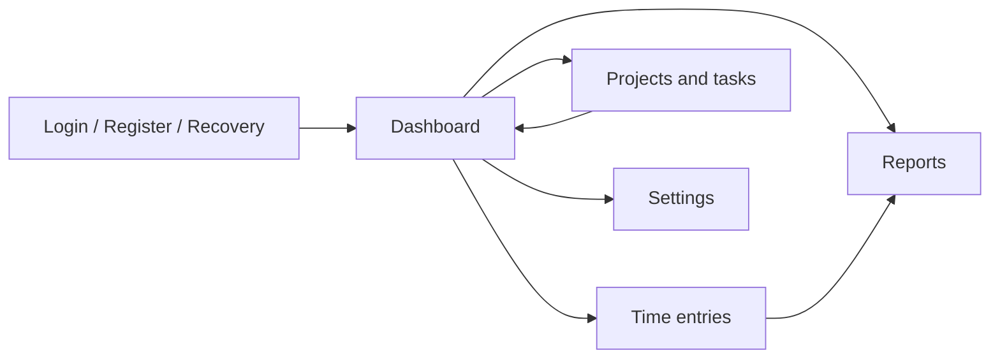

# Low-fi прототип

## Экран 1. Login

- Логотип WorkTime Manager.
- Режимы: вход, регистрация, восстановление пароля.
- Поля email и пароль с валидацией формата.
- Регистрация проверяет силу пароля: минимум 8 символов, верхний/нижний регистр и цифра.
- Восстановление пароля показывает mock reset link, потому что mock-сервер не отправляет реальные email.

## Экран 2. Dashboard

- Верхняя панель: текущий пользователь, logout.
- Метрики: сегодня, дневная цель, последние 7 дней, план/факт, активный проект.
- Таймер: проект, задача, описание, старт/стоп.
- Последние записи.

## Экран 3. Time entries

- Фильтры: поиск, проект, период, сортировка.
- Таблица записей.
- Форма создания/редактирования.
- Действия: сохранить, удалить с подтверждением.

## Экран 4. Reports

- Период отчета.
- Сводка по проектам.
- Сравнение планового и фактического времени со статусами: on track, close to plan, over planned time.
- Экспорт CSV с названием файла по проекту и периоду.

## Экран 5. Projects

- Форма проекта: название, клиент, плановые часы, цвет.
- Список проектов с действиями редактирования и удаления.
- Форма задачи: проект, название, плановые часы, статус.
- Список задач с защитой удаления, если по задаче уже есть записи времени.
- Подтверждение удаления для проектов и задач.

## Карта переходов

